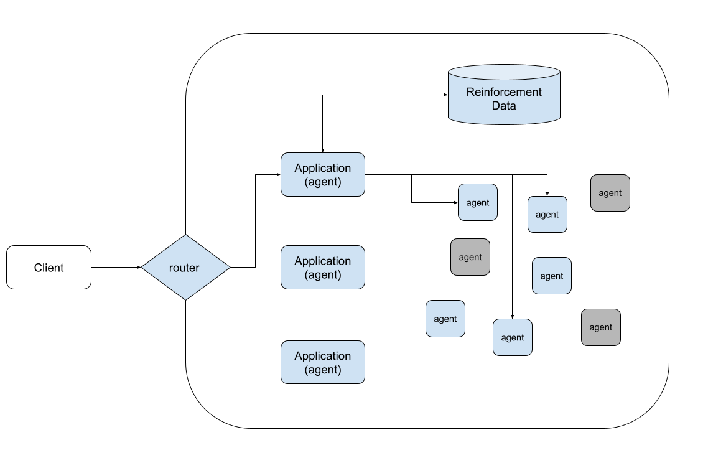

# arpanet 
#### A Reinforced and Partitioned Agent Network

This is a reference (toy) implementation of a nested agent network with reinforcement. It is meant to serve as a general architecture guide for more complex systems.




_Agent¹ examples_: Web search, Database analysis, custom agents...
_Application² examples_: BabyAgi, AutoGPT, custom applications...


¹ Agents use a language model as a reasoning engine to determine which actions to take and in which order
² Applications are agents that have a custom prompt and output parser with a collection of child agents


## Directory Structure
```
router.py
- my_apps
  - custom_app
  - autogpt
  - babyagi
- my_agents
  - search
  - calculator
  - sqldb
```

## Example code
router.py
``` python
app = get_app()
agents = get_agents()
while True:
    app(agents, input('Enter request: '))
```

Command line
```
python3 router.py app=hearst_app agents=search,sqldb
```